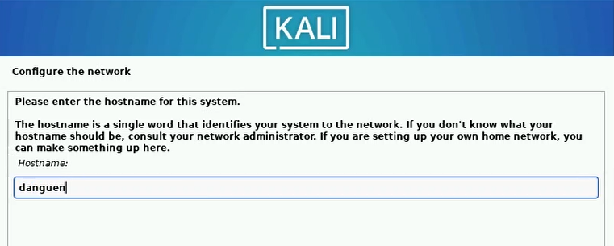

---
## Front matter
lang: ru-RU
title: Презентация по Индивидуальному проекту
subtitle: Этап 1. Установка Kali Linux
author:
  - Нгуен Дык Ань
institute:
  - Российский университет дружбы народов, Москва, Россия
date: 6 сентября 2024

## i18n babel
babel-lang: russian
babel-otherlangs: english

## Formatting pdf
toc: false
toc-title: Содержание
slide_level: 2
aspectratio: 43
section-titles: true
theme: metropolis
header-includes:
 - \metroset{progressbar=frametitle,sectionpage=progressbar,numbering=fraction}
 - '\makeatletter'
 - '\beamer@ignorenonframefalse'
 - '\makeatother'
---

# Докладчик

:::::::::::::: {.columns align=center}
::: {.column width="70%"}

  * Нгуен Дык Ань
  * Студенческий билет: 1032215251
  * Группа: НКНбд-01-21
  * Российский университет дружбы народов
  * <https://github.com/NguyenDucAnh0512>

:::
::: {.column width="30%"}

:::
::::::::::::::

# Цель работы

Установить операционную систему на виртуальную машину.

# Установить операционную систему Kali Linux на VirtualBox

- Создать новую виртуальную машину, укажать называние и тип операционной системы — Linux, Debian.

- Укажать размер основной памяти виртуальной машины - 4096 МБ, и количество процессора - 2.

- Задавать размер диска — 25 ГБ.

- Добавить новый привод оптических дисков.

# Установить операционную систему Kali Linux на VirtualBox

# Настроить систему для работы

- Выбрать вариант графической установки

- В разделе «Настройка сети» вводить имя хоста системы

- Вводить доменное имя

- Создать учетную запись пользователя, указав его полное имя и имя пользователя

- Создать пароль для учетной записи пользователя

- Выбрать способ разбиения жесткого диска

- Выбрать диск, который использовать для разбиения

- Выбрать схему разбиения

# Настроить систему для работы

- Затем выбрать опцию "Finish partitioning and write changes to disk option", потом начинаю установку Kali

- Выбрать среду рабочего стола и инструменты

- Установить загрузчик GRUB на жесткий диск

- Выбрать устройство загрузчика, чтобы убедиться, что вновь установленная система является загрузочной

- Когда установка Kali завершится, появится сообщение «Установка завершена». Нажать «Продолжить», чтобы перезагрузить виртуальную машину

# Настроить систему для работы

# Вывод

После лабораторной работы я установил операционную систему Kali Linux на виртуальную машину.
