---
## Front matter
lang: ru-RU
title: Презентация по Индивидуальному проекту
subtitle: Этап 2. Установка DVWA
author:
  - Нгуен Дык Ань
institute:
  - Российский университет дружбы народов, Москва, Россия
date: 19 сентября 2024

## i18n babel
babel-lang: russian
babel-otherlangs: english

## Formatting pdf
toc: false
toc-title: Содержание
slide_level: 2
aspectratio: 43
section-titles: true
theme: metropolis
header-includes:
 - \metroset{progressbar=frametitle,sectionpage=progressbar,numbering=fraction}
 - '\makeatletter'
 - '\beamer@ignorenonframefalse'
 - '\makeatother'
---

# Докладчик

:::::::::::::: {.columns align=center}
::: {.column width="70%"}

  * Нгуен Дык Ань
  * Студенческий билет: 1032215251
  * Группа: НКНбд-01-21
  * Российский университет дружбы народов
  * <https://github.com/NguyenDucAnh0512>

:::
::: {.column width="30%"}

:::
::::::::::::::

# Цель работы

Установить и настроить DVWA в систему к Kali Linux

# Выполнение работы

- В консоли перейти в директорию /var/www/html и клонировать DVWA git-директория

- Настроить доступ директории DVWA, что DVWA полностью доступным для чтения, записи и исполнения для всех

- Скопировать файл конфигурации /var/www/html/DVWA/config/config.inc.php.dist на config.inc.php

- Поменять имя и пароль пользователя в файле конфигурации config.inc.php

#

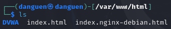

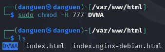

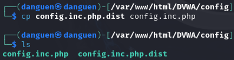

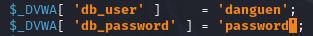

# Выполнение работы

- Запустить базу данных в консоли

- После того, войти в базу данных

- Создать базу данных с именем dvwa

- Cоздать пользователя и пароль

- Предоставить все привилегии этому пользователю

#

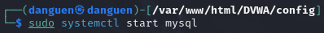

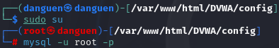

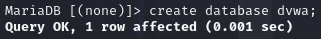

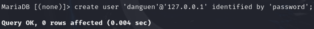

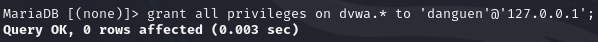

# Выполнение работы

- Запустить веб-сервер Apache2

- Поменять файл конфигурации /etc/php/8.2/apache2/php.ini как следующий

- Перезагрузить веб-сервер Apache2

- В браузере войти в ссыльку "127.0.0.1/DVWA" и вводить username и пароль, DVWA готов для использования

#

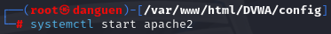

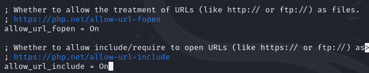

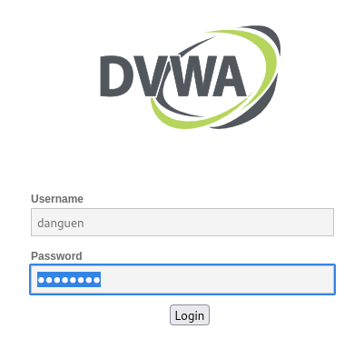

# Вывод

После этой лабораторной работы я установил и настроил DVWA в систему к Kali Linux
