---
## Front matter
title: "Отчёт по Индивидуальному проекту"
subtitle: "Этап 2. Установка DVWA"
author: "Нгуен Дык Ань"

## Generic otions
lang: ru-RU
toc-title: "Содержание"

## Bibliography
bibliography: bib/cite.bib
csl: pandoc/csl/gost-r-7-0-5-2008-numeric.csl

## Pdf output format
toc: true # Table of contents
toc-depth: 2
lof: false # List of figures
lot: false # List of tables
fontsize: 12pt
linestretch: 1.5
papersize: a4
documentclass: scrreprt
## I18n polyglossia
polyglossia-lang:
  name: russian
  options:
	- spelling=modern
	- babelshorthands=true
polyglossia-otherlangs:
  name: english
## I18n babel
babel-lang: russian
babel-otherlangs: english
## Fonts
mainfont: PT Serif
romanfont: PT Serif
sansfont: PT Sans
monofont: PT Mono
mainfontoptions: Ligatures=TeX
romanfontoptions: Ligatures=TeX
sansfontoptions: Ligatures=TeX,Scale=MatchLowercase
monofontoptions: Scale=MatchLowercase,Scale=0.9
## Biblatex
biblatex: true
biblio-style: "gost-numeric"
biblatexoptions:
  - parentracker=true
  - backend=biber
  - hyperref=auto
  - language=auto
  - autolang=other*
  - citestyle=gost-numeric
## Pandoc-crossref LaTeX customization
figureTitle: "Рис."
tableTitle: "Таблица"
listingTitle: "Листинг"
lofTitle: "Список иллюстраций"
lotTitle: "Список таблиц"
lolTitle: "Листинги"
## Misc options
indent: true
header-includes:
  - \usepackage[T2B]{fontenc}
  - \usepackage{indentfirst}
---

# I.Цель работы

Установить и настроить DVWA в систему к Kali Linux.

# III. Выполнение работы

- В консоли перейти в директорию /var/www/html (это директория по умочанью вев-сервера) и клонировать DVWA git-директория.

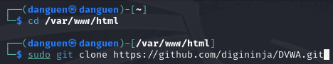

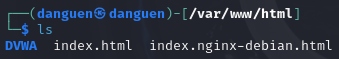

- Настроить доступ директории DVWA, что DVWA полностью доступным для чтения, записи и исполнения для всех.

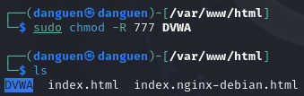

- Скопировать файл конфигурации /var/www/html/DVWA/config/config.inc.php.dist на config.inc.php.

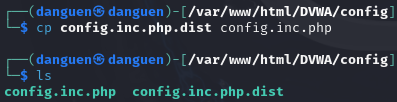

- Поменять имя и пароль пользователя в файле конфигурации config.inc.php.

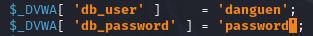

- Запустить базу данных в консоли и проверять статус базы данных.

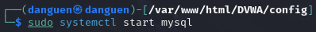

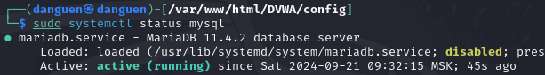

- После того, войти в базу данных.

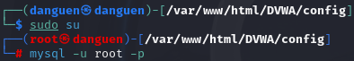

- Создать базу данных с именем dvwa.

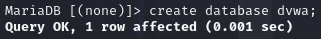

- Cоздать пользователя и пароль (должны совпадать с именем пользователя и паролем в файле конфигурации).

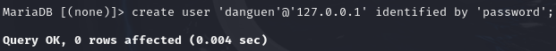

- Предоставить все привилегии этому пользователю.

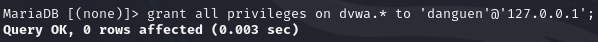

- Запустить и проверять статус веб-сервер Apache2.

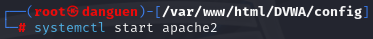

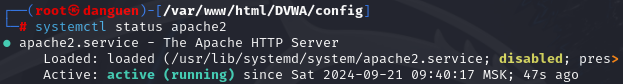

- Поменять файл конфигурации /etc/php/8.2/apache2/php.ini как следующий.

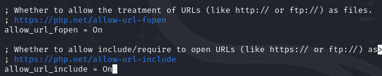

- Перезагрузить веб-сервер Apache2.

- В браузере войти в ссыльку "127.0.0.1/DVWA" и вводить username и пароль, DVWA готов для использования.

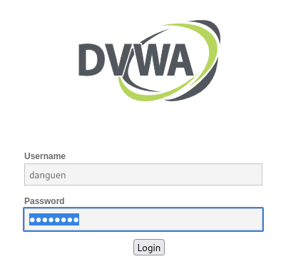

# IV. Вывод

После этой лабораторной работы я установил и настроил DVWA в систему к Kali Linux.

