---
## Front matter
lang: ru-RU
title: Презентация по лабораторной работе №2
subtitle: Дискреционное разграничение прав в Linux. Основные атрибуты
author:
  - Нгуен Дык Ань
institute:
  - Российский университет дружбы народов, Москва, Россия
date: 14 сентября 2024

## i18n babel
babel-lang: russian
babel-otherlangs: english

## Formatting pdf
toc: false
toc-title: Содержание
slide_level: 2
aspectratio: 43
section-titles: true
theme: metropolis
header-includes:
 - \metroset{progressbar=frametitle,sectionpage=progressbar,numbering=fraction}
 - '\makeatletter'
 - '\beamer@ignorenonframefalse'
 - '\makeatother'
---

# Докладчик

:::::::::::::: {.columns align=center}
::: {.column width="70%"}

  * Нгуен Дык Ань
  * Студенческий билет: 1032215251
  * Группа: НКНбд-01-21
  * Российский университет дружбы народов
  * <https://github.com/NguyenDucAnh0512>

:::
::: {.column width="30%"}

:::
::::::::::::::

# Цель работы

Получить практические навыки работы в консоли с атрибутами файлов и дискреционного управления доступа в современных системах с открытым кодом на базе ОС Linux.

# Выполнение работы

- Используя учетную запись администратора, создаем учетную запись пользователя **guest** и поставить пароль для **guest**

- Войти в систему от имени пользователя guest

- Используя команду pwd, определим директорию, в который мы находимся

- Команда **whoami** показывает имя моего пользователя: guest

- Команда **id** уточнит значения uid, gid и группа пользователя

#

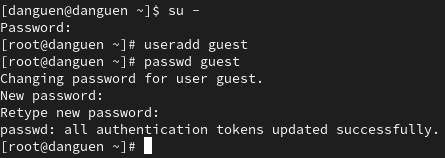

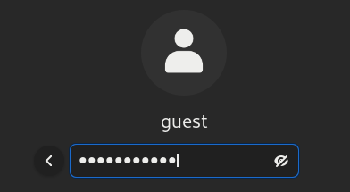

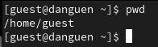

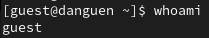

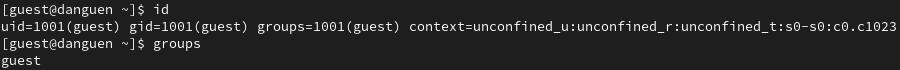

# Выполнение работы

- В файле /etc/passwd находится наша учётная запись, значения uid, gid пользователя

- С помощью команды ls -l /home мы получили список поддиректорий директории /home

- Мы можем смотреть расширенные атрибуты установлены на поддиректориях, находящихся в директории /home, командой lsattr /home

- Создать в домашней директории поддиректорию dir1, определить командами **ls -l** и **lsattr**

#

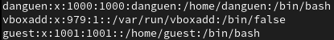

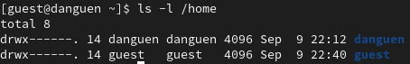

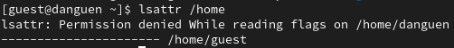

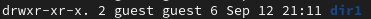

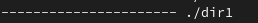

# Выполнение работы

- Снимать с директории dir1 все атрибуты командой **chmod 000 dir1**

- При создании в директории dir1 файл file1 командой **echo "test" > /home/guest/dir1/file1**, мы получили отказ в выполнении операции

# 

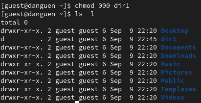

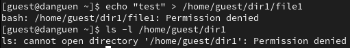

# Вывод

После лабораторной работы я получил практические навыки работы в консоли с атрибутами файлов и дискреционного управления доступа в системах на базе ОС Linux.
