---
## Front matter
title: "Отчёт по лабораторной работе №2"
subtitle: "Дискреционное разграничение прав в Linux. Основные атрибуты"
author: "Нгуен Дык Ань"

## Generic otions
lang: ru-RU
toc-title: "Содержание"

## Bibliography
bibliography: bib/cite.bib
csl: pandoc/csl/gost-r-7-0-5-2008-numeric.csl

## Pdf output format
toc: true # Table of contents
toc-depth: 2
lof: false # List of figures
lot: false # List of tables
fontsize: 12pt
linestretch: 1.5
papersize: a4
documentclass: scrreprt
## I18n polyglossia
polyglossia-lang:
  name: russian
  options:
	- spelling=modern
	- babelshorthands=true
polyglossia-otherlangs:
  name: english
## I18n babel
babel-lang: russian
babel-otherlangs: english
## Fonts
mainfont: PT Serif
romanfont: PT Serif
sansfont: PT Sans
monofont: PT Mono
mainfontoptions: Ligatures=TeX
romanfontoptions: Ligatures=TeX
sansfontoptions: Ligatures=TeX,Scale=MatchLowercase
monofontoptions: Scale=MatchLowercase,Scale=0.9
## Biblatex
biblatex: true
biblio-style: "gost-numeric"
biblatexoptions:
  - parentracker=true
  - backend=biber
  - hyperref=auto
  - language=auto
  - autolang=other*
  - citestyle=gost-numeric
## Pandoc-crossref LaTeX customization
figureTitle: "Рис."
tableTitle: "Таблица"
listingTitle: "Листинг"
lofTitle: "Список иллюстраций"
lotTitle: "Список таблиц"
lolTitle: "Листинги"
## Misc options
indent: true
header-includes:
  - \usepackage[T2B]{fontenc}
  - \usepackage{indentfirst}
---

# I.Цель работы

Получить практические навыки работы в консоли с атрибутами файлов и дискреционного управления доступа в современных системах с открытым кодом на базе ОС Linux.

# III. Выполнение работы

- Используя учетную запись администратора, создаем учетную запись пользователя **guest** и поставить пароль для **guest**.

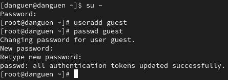

- Войти в систему от имени пользователя guest.

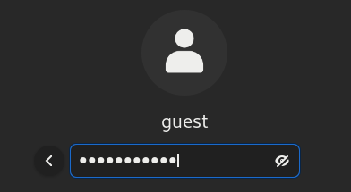

- Используя команду pwd, определим директорию, в который мы находимся. Сравним её с приглашением командной строки, можем говорить, что имена пользователя похожа на называние директории. Поэтому, эта директория является домашней директорией пользователя guest.

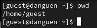

- Команда **whoami** показывает имя моего пользователя: guest.

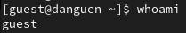

- Команда **id** уточнит значения uid, gid и группа пользователя. И сравнение вывода id с выводом команды groups показывает группу, куда входит пользователь guest.

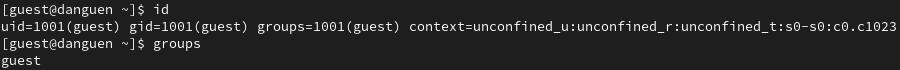

- В файле /etc/passwd находится наша учётная запись, значения uid, gid пользователя - 1001 (guest), и сравним найденные значения с полученными в предыдущих пунктах, они одинаковые.

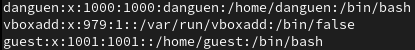

- С помощью команды ls -l /home мы получили список поддиректорий директории /home. Поддиректории danguen (админ) и guest имеют доступ для чтения, записи и исполнения для пользователей.

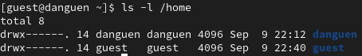

- Мы можем смотреть расширенные атрибуты установлены на поддиректориях, находящихся в директории /home, командой lsattr /home, и увидем, что директории guest нет  расширенного атрибута, а директории danguen у нас нет доступа для смотрения расширенного атрибута.

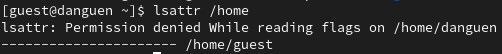

- Создать в домашней директории поддиректорию dir1, определить командами **ls -l** и **lsattr**, dir1 имеет права чтения, записи и исполнения для пользователей, а расширенного атрибута нет.

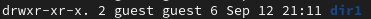

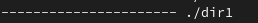

- Снимать с директории dir1 все атрибуты командой **chmod 000 dir1**

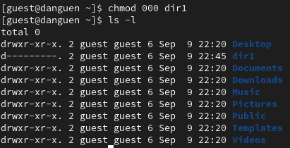

- При создании в директории dir1 файл file1 командой **echo "test" > /home/guest/dir1/file1**, мы получили отказ в выполнении операции. Причина в том, что в предыдущих пунктах мы снимили с директории dir1 все атрибуты, поэтому мы не можем создать файл.

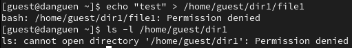

- Таблица 2.1: Установленные права и разрешённые действия.

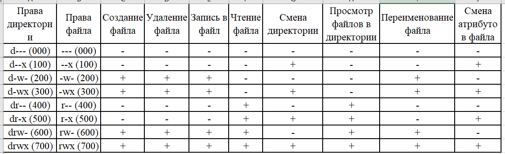

- Таблица 2.2: Минимальные права для совершения операций

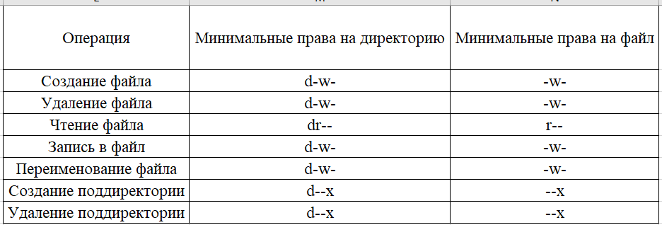

# IV. Вывод

После лабораторной работы я получил практические навыки работы в консоли с атрибутами файлов и дискреционного управления доступа в системах на базе ОС Linux.
