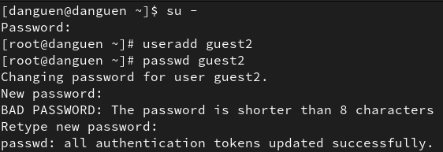
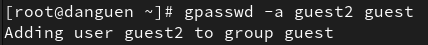
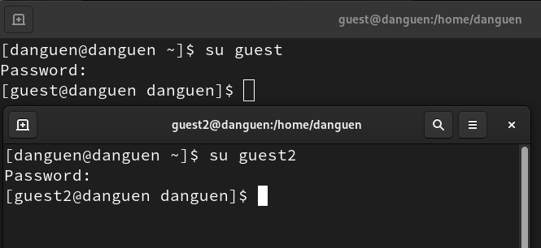
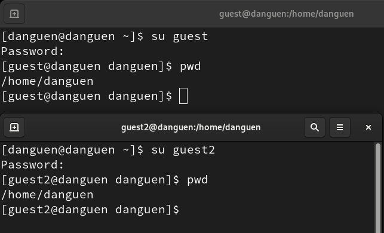
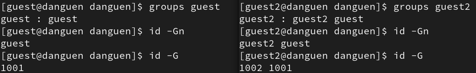
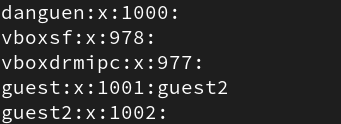
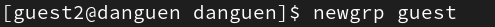
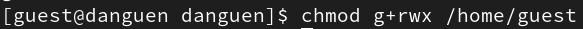

---
## Front matter
lang: ru-RU
title: Презентация по лабораторной работе №3
subtitle: Дискреционное разграничение прав в Linux. Два пользователя
author:
  - Нгуен Дык Ань
institute:
  - Российский университет дружбы народов, Москва, Россия
date: 19 сентября 2024

## i18n babel
babel-lang: russian
babel-otherlangs: english

## Formatting pdf
toc: false
toc-title: Содержание
slide_level: 2
aspectratio: 43
section-titles: true
theme: metropolis
header-includes:
 - \metroset{progressbar=frametitle,sectionpage=progressbar,numbering=fraction}
 - '\makeatletter'
 - '\beamer@ignorenonframefalse'
 - '\makeatother'
---

# Докладчик

:::::::::::::: {.columns align=center}
::: {.column width="70%"}

  * Нгуен Дык Ань
  * Студенческий билет: 1032215251
  * Группа: НКНбд-01-21
  * Российский университет дружбы народов
  * <https://github.com/NguyenDucAnh0512>

:::
::: {.column width="30%"}

:::
::::::::::::::

# Цель работы

Получить практические навыки работы в консоли с атрибутами файлов для групп пользователей

# Выполнение работы

- Используя учетную запись администратора, создаем учетную запись пользователя "guest2" и поставить пароль для "guest2"

- Добавить пользователя guest2 в группу guest

- Войти в систему как два пользователя на двух разных консолях: гость на первой консоли и гость2 на второй консоли

- Используем команду "pwd" определить директорию, в которой мы находимся

#

# Выполнение работы

- Определить в какие группы входят пользователи guest и guest2, сравнить вывод команды groups с выводом команд id -Gn и id -G

- Сравнить полученную информацию с содержимым файла /etc/group

- От имени пользователя guest2 выполнить регистрацию пользователя guest2 в группе guest

- От имени пользователя guest изменить права директории /home/guest, разрешив все действия для пользователей группы

#

# Вывод

После лабораторной работы я получил практические навыки работы в консоли с атрибутами файлов для групп пользователей
