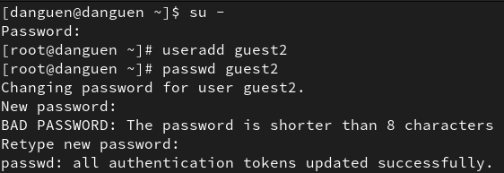
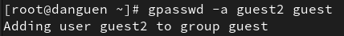
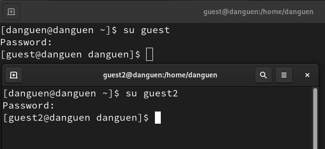
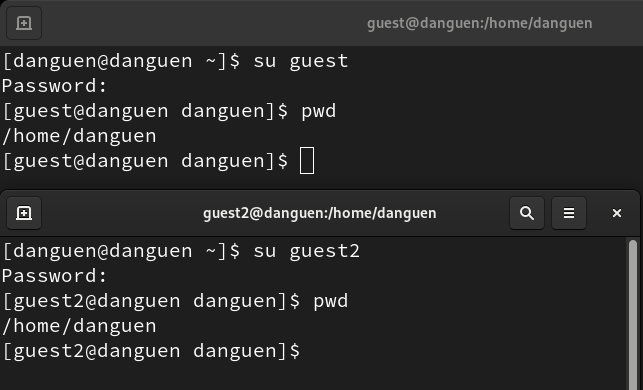
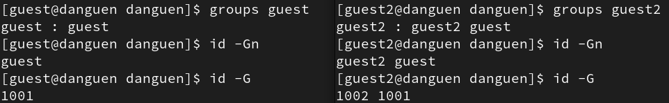
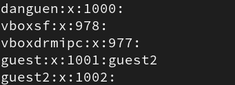
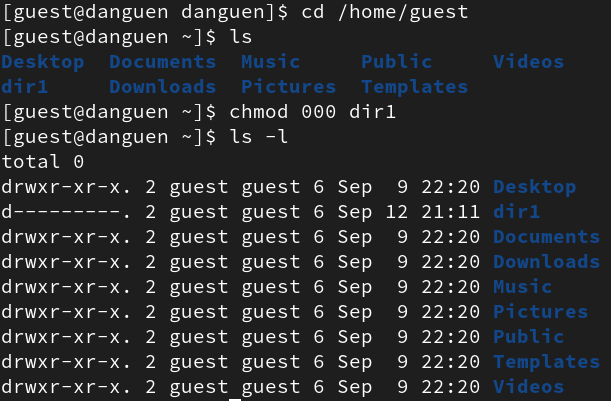

---
## Front matter
title: "Отчёт по лабораторной работе №3"
subtitle: "Дискреционное разграничение прав в Linux. Два пользователя"
author: "Нгуен Дык Ань"

## Generic otions
lang: ru-RU
toc-title: "Содержание"

## Bibliography
bibliography: bib/cite.bib
csl: pandoc/csl/gost-r-7-0-5-2008-numeric.csl

## Pdf output format
toc: true # Table of contents
toc-depth: 2
lof: false # List of figures
lot: false # List of tables
fontsize: 12pt
linestretch: 1.5
papersize: a4
documentclass: scrreprt
## I18n polyglossia
polyglossia-lang:
  name: russian
  options:
	- spelling=modern
	- babelshorthands=true
polyglossia-otherlangs:
  name: english
## I18n babel
babel-lang: russian
babel-otherlangs: english
## Fonts
mainfont: PT Serif
romanfont: PT Serif
sansfont: PT Sans
monofont: PT Mono
mainfontoptions: Ligatures=TeX
romanfontoptions: Ligatures=TeX
sansfontoptions: Ligatures=TeX,Scale=MatchLowercase
monofontoptions: Scale=MatchLowercase,Scale=0.9
## Biblatex
biblatex: true
biblio-style: "gost-numeric"
biblatexoptions:
  - parentracker=true
  - backend=biber
  - hyperref=auto
  - language=auto
  - autolang=other*
  - citestyle=gost-numeric
## Pandoc-crossref LaTeX customization
figureTitle: "Рис."
tableTitle: "Таблица"
listingTitle: "Листинг"
lofTitle: "Список иллюстраций"
lotTitle: "Список таблиц"
lolTitle: "Листинги"
## Misc options
indent: true
header-includes:
  - \usepackage[T2B]{fontenc}
  - \usepackage{indentfirst}
---

# I.Цель работы

Получить практические навыки работы в консоли с атрибутами файлов для групп пользователей.

# III. Выполнение работы

- Используя учетную запись администратора, создаем учетную запись пользователя "guest2" и поставить пароль для "guest2".

- Добавить пользователя guest2 в группу guest.

- Войти в систему как два пользователя на двух разных консолях: гость на первой консоли и гость2 на второй консоли.

- Используем команду "pwd" определить директорию, в которой мы находимся. Сравним её с приглашениями командной строки, мы увидем, что мы находимся не на домащней директории.

- Определить командами groups guest и groups guest2. Пользователь guest входит в группу guest, а пользователь guest2 входит в группы guest2 и guest. Вывод id -G показывает все значения группы IDs, и вывод id -Gn показывает называние вместо значения.

- Сравним полученную информацию с содержимым файла /etc/group, мы можем сказать, что они похожи.

- От имени пользователя guest2 выполнить регистрацию пользователя guest2 в группе guest.

- От имени пользователя guest изменить права директории /home/guest, разрешив все действия для пользователей группы.

- От имени пользователя guest снимать с директории /home/guest/dir1 все атрибуты.

- Таблица: Установленные права и разрешённые действия для групп

| Права д. | Права ф. | Соз. Ф. | Уд. Ф. | Зап. в ф. | Чт. Ф. | Смена д. | Просмотр ф. в д. | Переи. Ф. | Смена а. Ф. |
|----------|----------|---------|--------|-----------|--------|----------|------------------|-----------|-------------|
| 000      | 000      | -       | -      | -         | -      | -        | -                | -         | -           |
| 010      | 000      | -       | -      | -         | -      | +        | -                | -         | -           |
| 020      | 000      | -       | -      | -         | -      | -        | -                | -         | -           |
| 030      | 000      | +       | +      | -         | -      | +        | -                | -         | +           |
| 040      | 000      | -       | -      | -         | -      | -        | -                | -         | -           |
| 050      | 000      | -       | -      | -         | -      | +        | +                | -         | -           |
| 060      | 000      | +       | +      | -         | -      | -        | -                | -         | -           |
| 070      | 000      | +       | +      | -         | -      | +        | +                | -         | +           |
| 000      | 010      | -       | -      | -         | -      | -        | -                | -         | -           |
| 010      | 010      | -       | -      | -         | -      | +        | -                | -         | -           |
| 020      | 010      | -       | -      | -         | -      | -        | -                | -         | -           |
| 030      | 010      | +       | +      | -         | -      | +        | -                | -         | +           |
| 040      | 010      | -       | -      | -         | -      | -        | -                | -         | -           |
| 050      | 010      | -       | -      | -         | -      | +        | +                | -         | -           |
| 060      | 010      | +       | +      | -         | -      | -        | -                | -         | -           |
| 070      | 010      | +       | +      | -         | -      | +        | +                | -         | +           |
| 000      | 020      | -       | -      | -         | -      | -        | -                | -         | -           |
| 010      | 020      | -       | -      | -         | -      | +        | -                | -         | -           |
| 020      | 020      | -       | -      | -         | -      | -        | -                | -         | -           |
| 030      | 020      | +       | +      | -         | -      | +        | -                | +         | +           |
| 040      | 020      | -       | -      | -         | -      | -        | -                | -         | -           |
| 050      | 020      | -       | -      | -         | -      | +        | +                | -         | -           |
| 060      | 020      | +       | +      | -         | -      | -        | -                | -         | -           |
| 070      | 020      | +       | +      | -         | -      | +        | +                | +         | +           |
| 000      | 030      | -       | -      | -         | -      | -        | -                | -         | -           |
| 010      | 030      | -       | -      | +         | -      | +        | -                | -         | -           |
| 020      | 030      | -       | -      | -         | -      | -        | -                | -         | -           |
| 030      | 030      | +       | +      | +         | -      | +        | -                | +         | +           |
| 040      | 030      | -       | -      | -         | -      | -        | -                | -         | -           |
| 050      | 030      | -       | -      | +         | -      | +        | +                | -         | -           |
| 060      | 030      | +       | +      | -         | -      | -        | -                | -         | -           |
| 070      | 030      | +       | +      | +         | -      | +        | +                | +         | +           |
| 000      | 040      | -       | -      | -         | -      | -        | -                | -         | -           |
| 010      | 040      | -       | -      | -         | +      | +        | -                | -         | -           |
| 020      | 040      | -       | -      | -         | -      | -        | -                | -         | -           |
| 030      | 040      | +       | +      | -         | +      | +        | -                | -         | +           |
| 040      | 040      | -       | -      | -         | -      | -        | -                | -         | -           |
| 050      | 040      | -       | -      | -         | +      | +        | +                | -         | -           |
| 060      | 040      | +       | +      | -         | -      | -        | -                | -         | -           |
| 070      | 040      | +       | +      | -         | +      | +        | +                | -         | +           |
| 000      | 050      | -       | -      | -         | -      | -        | -                | -         | -           |
| 010      | 050      | -       | -      | -         | +      | +        | -                | -         | -           |
| 020      | 050      | -       | -      | -         | -      | -        | -                | -         | -           |
| 030      | 050      | +       | +      | -         | +      | +        | -                | -         | +           |
| 040      | 050      | -       | -      | -         | -      | -        | -                | -         | -           |
| 050      | 050      | -       | -      | -         | +      | +        | +                | -         | -           |
| 060      | 050      | +       | +      | -         | -      | -        | -                | -         | -           |
| 070      | 050      | +       | +      | -         | +      | +        | +                | -         | +           |
| 000      | 060      | -       | -      | -         | -      | -        | -                | -         | -           |
| 010      | 060      | -       | -      | +         | +      | +        | -                | -         | -           |
| 020      | 060      | -       | -      | -         | -      | -        | -                | -         | -           |
| 030      | 060      | +       | +      | +         | +      | +        | -                | +         | +           |
| 040      | 060      | -       | -      | -         | -      | -        | -                | -         | -           |
| 050      | 060      | -       | -      | +         | +      | +        | +                | -         | -           |
| 060      | 060      | +       | +      | -         | -      | -        | -                | -         | -           |
| 070      | 060      | +       | +      | +         | +      | +        | +                | +         | +           |
| 000      | 070      | -       | -      | -         | -      | -        | -                | -         | -           |
| 010      | 070      | -       | -      | +         | +      | +        | -                | -         | -           |
| 020      | 070      | -       | -      | -         | -      | -        | -                | -         | -           |
| 030      | 070      | +       | +      | +         | +      | +        | -                | +         | +           |
| 040      | 070      | -       | -      | -         | -      | -        | -                | -         | -           |
| 050      | 070      | -       | -      | +         | +      | +        | +                | -         | -           |
| 060      | 070      | +       | +      | -         | -      | -        | -                | -         | -           |
| 070      | 070      | +       | +      | +         | +      | +        | +                | +         | +           |

- Таблица: Минимальные права для совершения операций от имени пользователей входящих в группу

| Операция               | Минимальные права на директорию | Минимальные права на файл |
|------------------------|---------------------------------|---------------------------|
| Создание файла         | 030                             | 000                       |
| Удаление файла         | 030                             | 000                       |
| Чтение файла           | 010                             | 040                       |
| Запись в файл          | 010                             | 020                       |
| Переименование файла   | 030                             | 020                       |
| Создание поддиректории | 030                             | 000                       |
| Удаление поддиректории | 030                             | 030                       |

# IV. Вывод

После лабораторной работы я получил практические навыки работы в консоли с атрибутами файлов для групп пользователей.
