---
## Front matter
lang: ru-RU
title: Презентация по лабораторной работе №4
subtitle: Дискреционное разграничение прав в Linux. Расширенные атрибуты
author:
  - Нгуен Дык Ань
institute:
  - Российский университет дружбы народов, Москва, Россия
date: 28 сентября 2024

## i18n babel
babel-lang: russian
babel-otherlangs: english

## Formatting pdf
toc: false
toc-title: Содержание
slide_level: 2
aspectratio: 43
section-titles: true
theme: metropolis
header-includes:
 - \metroset{progressbar=frametitle,sectionpage=progressbar,numbering=fraction}
 - '\makeatletter'
 - '\beamer@ignorenonframefalse'
 - '\makeatother'
---

# Докладчик

:::::::::::::: {.columns align=center}
::: {.column width="70%"}

  * Нгуен Дык Ань
  * Студенческий билет: 1032215251
  * Группа: НКНбд-01-21
  * Российский университет дружбы народов
  * <https://github.com/NguyenDucAnh0512>

:::
::: {.column width="30%"}

:::
::::::::::::::

# Цель работы

Получить практические навыки работы в консоли с расширенными атрибутами файлов

# Выполнение работы

- Мы получил отказ от системы:

  * При определении расширенных атрибут файл от имени guest

  * При устаноки команды chmod 600 file1 на файл file1

  * При устаноки на файл file1 расширенный атрибут +a от имени пользователя guest

- От имени администратора мы установили расширенный атрибут a на файл file1

#

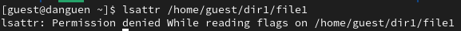

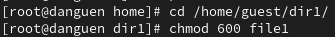

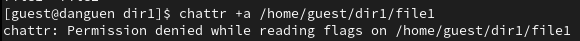

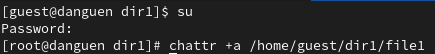

# После устаноки расширенный атрибут a на файл

- При проверки правильность установления атрибута от пользователя guest, мы получил отказ от системы, поэтому мы проверим от имени администратора

- Выполнить дозапись в файл file1 слова «test» и проверять командой cat

- При выполнении дозаписи в файл file1 слова «abcd» и переименовании файл и устаноки команды chmod 000 file1 и chmod 600 file1 на файл file1 мы не можем это сделать

#

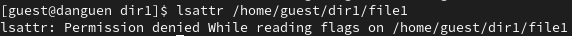
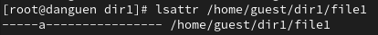

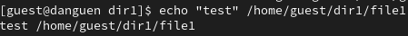
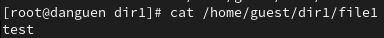

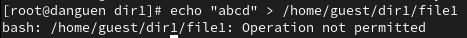
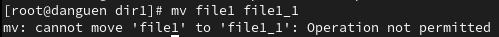

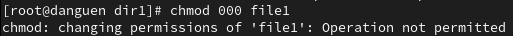
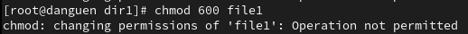

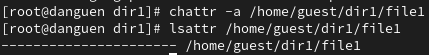

# После удаления расширенного атрибута a на файл

- После этого, мы можем выполнять дозапись в файл file1 слова «abcd» и переименовать файл

- И мы можем установать команды chmod 000 file1 и chmod 600 file1 на файл

- От имени администратора мы установили расширенный атрибут i на файл /home/guest/dir1/file1

#

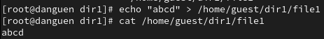
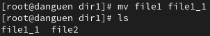

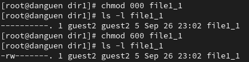

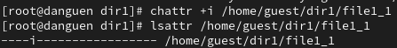

# После устаноки расширенный атрибут i на файл

- При выполнении дозаписи в файл file1 слова «test» и переименовании файл, мы не можем это сделать

- И при устаноки команды chmod 000 file1 и chmod 600 file1 на файл file1, мы получил отказ от системы

#

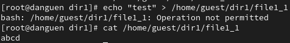
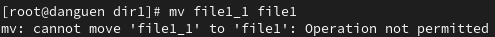

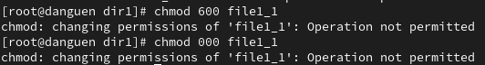

# Вывод

После лабораторной работы я получил практические навыки работы в консоли с расширенными атрибутами файлов
