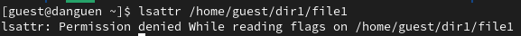

---
## Front matter
title: "Отчёт по лабораторной работе №4"
subtitle: "Дискреционное разграничение прав в Linux. Расширенные атрибуты"
author: "Нгуен Дык Ань"

## Generic otions
lang: ru-RU
toc-title: "Содержание"

## Bibliography
bibliography: bib/cite.bib
csl: pandoc/csl/gost-r-7-0-5-2008-numeric.csl

## Pdf output format
toc: true # Table of contents
toc-depth: 2
lof: false # List of figures
lot: false # List of tables
fontsize: 12pt
linestretch: 1.5
papersize: a4
documentclass: scrreprt
## I18n polyglossia
polyglossia-lang:
  name: russian
  options:
	- spelling=modern
	- babelshorthands=true
polyglossia-otherlangs:
  name: english
## I18n babel
babel-lang: russian
babel-otherlangs: english
## Fonts
mainfont: PT Serif
romanfont: PT Serif
sansfont: PT Sans
monofont: PT Mono
mainfontoptions: Ligatures=TeX
romanfontoptions: Ligatures=TeX
sansfontoptions: Ligatures=TeX,Scale=MatchLowercase
monofontoptions: Scale=MatchLowercase,Scale=0.9
## Biblatex
biblatex: true
biblio-style: "gost-numeric"
biblatexoptions:
  - parentracker=true
  - backend=biber
  - hyperref=auto
  - language=auto
  - autolang=other*
  - citestyle=gost-numeric
## Pandoc-crossref LaTeX customization
figureTitle: "Рис."
tableTitle: "Таблица"
listingTitle: "Листинг"
lofTitle: "Список иллюстраций"
lotTitle: "Список таблиц"
lolTitle: "Листинги"
## Misc options
indent: true
header-includes:
  - \usepackage[T2B]{fontenc}
  - \usepackage{indentfirst}
---

# I.Цель работы

Получить практические навыки работы в консоли с расширенными атрибутами файлов.

# III. Выполнение работы

- При определении расширенных атрибут файл от имени guest, мы получил отказ от системы.

- При устаноки команды chmod 600 file1 на файл file1 права, разрешающие чтение и запись для владельца файла от имени guest, мы получил отказ от системы.

- И при устаноки на файл /home/guest/dir1/file1 расширенный атрибут a от имени пользователя guest, мы получил отказ от системы.

- От имени администратора мы установили расширенный атрибут a на файл /home/guest/dir1/file1.

## 1. После устаноки расширенный атрибут a на файл

- Режим Append-Only: в файл можно добавлять только данные, существующие данные нельзя изменять или удалять. Это означает, что любая попытка обрезать файл или изменить его содержимое каким-либо другим способом приведет к ошибке.

- При проверки правильность установления атрибута от пользователя guest, мы получил отказ от системы, поэтому мы проверим от имени администратора.

- Выполнить дозапись в файл file1 слова «test» и проверять командой cat.

- При выполнении дозаписи в файл file1 слова «abcd» и переименовании файл, мы не можем это сделать.

- И при устаноки команды chmod 000 file1 и chmod 600 file1 на файл file1, мы получил отказ от системы.

- Снимать расширенный атрибут a с файла /home/guest/dirl/file1.

## 2. После удаления расширенного атрибута a на файл

- После этого, мы можем выполнять дозапись в файл file1 слова «abcd» и переименовать файл.

- И мы можем установать команды chmod 000 file1 и chmod 600 file1 на файл.

- От имени администратора мы установили расширенный атрибут i на файл /home/guest/dir1/file1.

## 2. После устаноки расширенный атрибут i на файл

- В Linux атрибут +i, известный как неизменяемый атрибут, после установки атрибута +i для файла файл не может быть изменен, удален или переименован. Это включает в себя такие операции, как запись в файл, усечение, удаление, переименование файла

- При выполнении дозаписи в файл file1 слова «test» и переименовании файл, мы не можем это сделать.

- И при устаноки команды chmod 000 file1 и chmod 600 file1 на файл file1, мы получил отказ от системы.

# IV. Вывод

После лабораторной работы я получил практические навыки работы в консоли с расширенными атрибутами файлов.
