---
## Front matter
lang: ru-RU
title: Презентация по лабораторной работе №5
subtitle: Дискреционное разграничение прав в Linux. Исследование влияния дополнительных атрибутов
author:
  - Нгуен Дык Ань
institute:
  - Российский университет дружбы народов, Москва, Россия
date: 05 октября 2024

## i18n babel
babel-lang: russian
babel-otherlangs: english

## Formatting pdf
toc: false
toc-title: Содержание
slide_level: 2
aspectratio: 43
section-titles: true
theme: metropolis
header-includes:
 - \metroset{progressbar=frametitle,sectionpage=progressbar,numbering=fraction}
 - '\makeatletter'
 - '\beamer@ignorenonframefalse'
 - '\makeatother'
---

# Докладчик

:::::::::::::: {.columns align=center}
::: {.column width="70%"}

  * Нгуен Дык Ань
  * Студенческий билет: 1032215251
  * Группа: НКНбд-01-21
  * Российский университет дружбы народов
  * <https://github.com/NguyenDucAnh0512>

:::
::: {.column width="30%"}

:::
::::::::::::::

# Цель работы

Исследовать механизм изменения идентификаторов с помощью битов SetUID и Sticky. Получить практические навыки работы в консолях с дополнительными свойствами. Рассмотрить механизм изменения идентификатора процесса пользователя, а также влияние бита Sticky на запись и удаление файлов

# Выполнение работы

## 1. Подготовка лабораторного стенда

- Установить gcc командой "yum install gcc".

- Отключить систему запретов до очередной перезагрузки системы командой "setenforce 0"

# 2. Создание программы и исследование

- Создать программу simpleid.c от имени пользователя guest, которая будет печатать на экране значения UID и GID после запуска

- Сравнить значения UID и GID

- Создать программу simpleid2.c, которая будет печатать на экране значения действительных идентификаторов

- От имени суперпользователя выполнить команды:

# 2. Создание программы и исследование

- "chown root:guest /home/guest/lab/simpleid2"

- "chmod u+s /home/guest/lab/simpleid2"

- Запустить simpleid2 и id, сравнить результат вывода

#

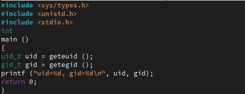

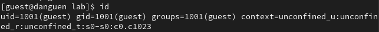

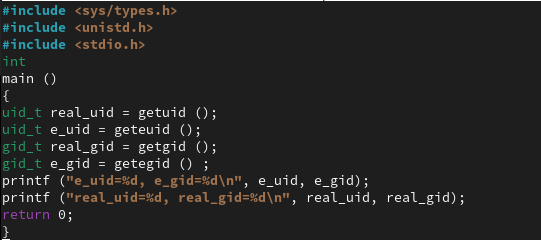

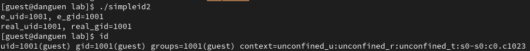

# 2. Создание программы и исследование

- Установить SetGID Бит для файла

- Проверять правильность установки новых атрибутов и смены владельца файла simpleid2

- Запустить simpleid2 и id, сравнить результат вывода

#

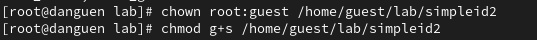

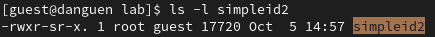

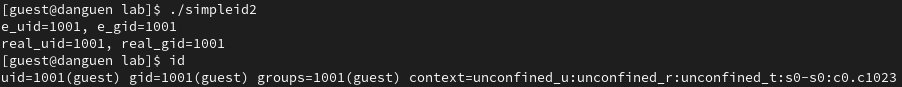

# 2. Создание программы и исследование

- Создать и откомпилировать программу readfile.c, которая читать файл

- Сменить владельца у файла readfile.c, чтобы только суперпользователь мог прочитать его, a guest не мог

- Сменить у программы readfile владельца и установить SetUID-бит и проверять

#

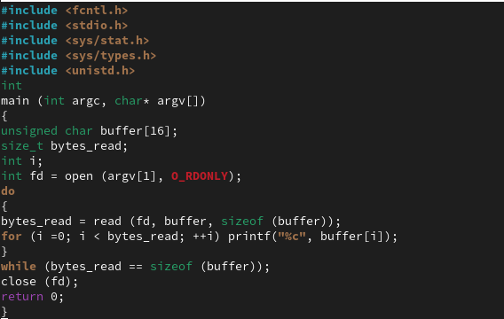

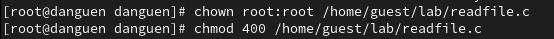

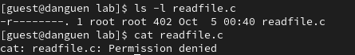

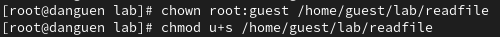

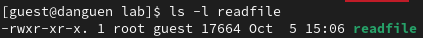

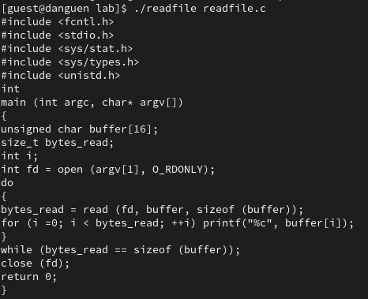

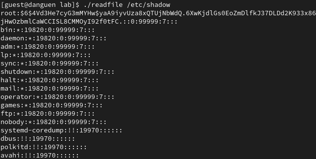

# 3. Исследование Sticky-бита

- Проверять установлен ли атрибут Sticky на директории /tmp командой "ls -l / | grep tmp"

- От имени пользователя guest создать файл file01.txt в директории /tmp со словом test

- Разрешить file01.txt прав чтения и записи для категории пользователей «все остальные»

- От пользователя guest2 (не является владельцем) попробовать прочитать файл /tmp/file01.txt

#

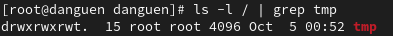

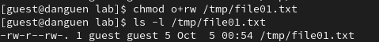

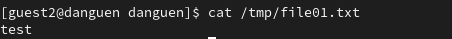

# 3. Исследование Sticky-бита

- От пользователя guest2 попробовать дозаписать в файл /tmp/file01.txt слово test2

- От пользователя guest2 попробовать удалить файл /tmp/file01.txt

#

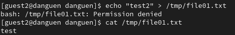

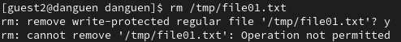

# 3. Исследование Sticky-бита

- Снимать атрибут t (Sticky-бит) с директории /tmp от имени суперпользователя

- Снова от пользователя guest2 попробовать дозаписать в файл /tmp/file01.txt слово test2

- Снова от пользователя guest2 попробовать удалить файл /tmp/file01.txt

- Вернуть атрибут t на директорию /tmp от имени суперпользователя

#

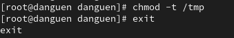

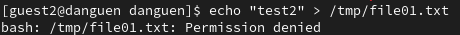

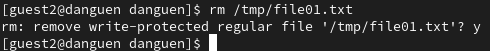

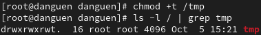

# Вывод

После лабораторной работы я получил практические навыки работы в консолях с дополнительными свойствами