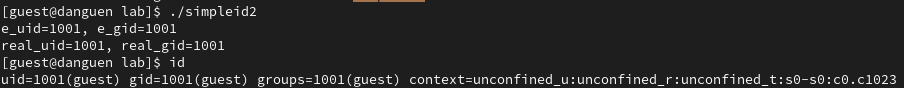
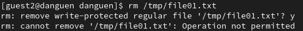
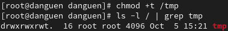

---
## Front matter
title: "Отчёт по лабораторной работе №5"
subtitle: "Дискреционное разграничение прав в Linux. Исследование влияния дополнительных атрибутов"
author: "Нгуен Дык Ань"

## Generic otions
lang: ru-RU
toc-title: "Содержание"

## Bibliography
bibliography: bib/cite.bib
csl: pandoc/csl/gost-r-7-0-5-2008-numeric.csl

## Pdf output format
toc: true # Table of contents
toc-depth: 2
lof: false # List of figures
lot: false # List of tables
fontsize: 12pt
linestretch: 1.5
papersize: a4
documentclass: scrreprt
## I18n polyglossia
polyglossia-lang:
  name: russian
  options:
	- spelling=modern
	- babelshorthands=true
polyglossia-otherlangs:
  name: english
## I18n babel
babel-lang: russian
babel-otherlangs: english
## Fonts
mainfont: PT Serif
romanfont: PT Serif
sansfont: PT Sans
monofont: PT Mono
mainfontoptions: Ligatures=TeX
romanfontoptions: Ligatures=TeX
sansfontoptions: Ligatures=TeX,Scale=MatchLowercase
monofontoptions: Scale=MatchLowercase,Scale=0.9
## Biblatex
biblatex: true
biblio-style: "gost-numeric"
biblatexoptions:
  - parentracker=true
  - backend=biber
  - hyperref=auto
  - language=auto
  - autolang=other*
  - citestyle=gost-numeric
## Pandoc-crossref LaTeX customization
figureTitle: "Рис."
tableTitle: "Таблица"
listingTitle: "Листинг"
lofTitle: "Список иллюстраций"
lotTitle: "Список таблиц"
lolTitle: "Листинги"
## Misc options
indent: true
header-includes:
  - \usepackage[T2B]{fontenc}
  - \usepackage{indentfirst}
---

# I.Цель работы

Исследовать механизм изменения идентификаторов с помощью битов SetUID и Sticky. Получить практические навыки работы в консолях с дополнительными свойствами. Рассмотрить механизм изменения идентификатора процесса пользователя, а также влияние бита Sticky на запись и удаление файлов.

# II. Выполнение работы

## 1. Подготовка лабораторного стенда

- Установить gcc командой "yum install gcc".

- Отключить систему запретов до очередной перезагрузки системы командой "setenforce 0".

## 2. Создание программы и исследование

- Создать программу simpleid.c от имени пользователя guest, которая будет печатать на экране значения UID и GID после запуска.

- Скомплилировать программу и выполнить программу.

- Сравнить значения UID и GID, результат программы и команды id одинаковые.

- Создать программу simpleid2.c, которая будет печатать на экране значения действительных идентификаторов.

- Скомпилировать и запустить simpleid2.c, получить значения real UID и real GID.

- От имени суперпользователя выполнить команды:

> "chown root:guest /home/guest/lab/simpleid2" - команда используется для смены владельца файлов и каталогов. Здесь файл "simpleid2" будет принадлежать пользователю «root» и группе «guest».

> "chmod u+s /home/guest/lab/simpleid2" - Бит SetUID устанавливает владельца исполняемого файла. Когда он установлен, файл будет выполняться с идентификатором пользователя владельца файла, а не того, кто его запустил.

- Проверять правильность установки новых атрибутов и смены владельца файла simpleid2, здесь владельца является root и группой guest. И атрибут s установлен для пользователя.

- Запустить simpleid2 и id, сравнить результат вывода мы увидем они одинаковые.

- Проделать тоже самое относительно SetGID-бита.

- Установить SetGID Бит для файла.

- Проверять правильность установки новых атрибутов и смены владельца файла simpleid2, здесь владельца является root и группой guest. И атрибут s установлен для группы.

- Запустить simpleid2 и id, сравнить результат вывода мы увидем они одинаковые.

- Создать и откомпилировать программу readfile.c, которая читать файл.

- Сменить владельца у файла readfile.c, чтобы только суперпользователь мог прочитать его, a guest не мог, и проверять.

- Сменить у программы readfile владельца и установить SetUID-бит и проверять.

- Проверять, может ли программа readfile прочитать файл readfile.c.

- Проверять, может ли программа readfile прочитать файл /etc/shadow.

## 3. Исследование Sticky-бита

- Проверять установлен ли атрибут Sticky на директории /tmp командой "ls -l / | grep tmp".

- От имени пользователя guest создать файл file01.txt в директории /tmp со словом test.

- Разрешить file01.txt прав чтения и записи для категории пользователей «все остальные».

- От пользователя guest2 (не является владельцем) попробовать прочитать файл /tmp/file01.txt.

- От пользователя guest2 попробовать дозаписать в файл /tmp/file01.txt слово test2, и нам не удалось выполнить операцию.

- От пользователя guest2 попробовать удалить файл /tmp/file01.txt, и нам не удалось выполнить операцию.

- Снимать атрибут t (Sticky-бит) с директории /tmp от имени суперпользователя.

- От пользователя guest2 проверять, что атрибута t у директории /tmp нет.

- Снова от пользователя guest2 попробовать дозаписать в файл /tmp/file01.txt слово test2, и нам не удалось выполнить операцию.

- Снова от пользователя guest2 попробовать удалить файл /tmp/file01.txt, и нам удалось выполнить операцию.

- Вернуть атрибут t на директорию /tmp от имени суперпользователя.

# III. Вывод

После лабораторной работы я получил практические навыки работы в консолях с дополнительными свойствами.
