---
## Front matter
lang: ru-RU
title: Презентация по лабораторной работе №6
subtitle: Мандатное разграничение прав в Linux
author:
  - Нгуен Дык Ань
institute:
  - Российский университет дружбы народов, Москва, Россия
date: 11 октября 2024

## i18n babel
babel-lang: russian
babel-otherlangs: english

## Formatting pdf
toc: false
toc-title: Содержание
slide_level: 2
aspectratio: 43
section-titles: true
theme: metropolis
header-includes:
 - \metroset{progressbar=frametitle,sectionpage=progressbar,numbering=fraction}
 - '\makeatletter'
 - '\beamer@ignorenonframefalse'
 - '\makeatother'
---

# Докладчик

:::::::::::::: {.columns align=center}
::: {.column width="70%"}

  * Нгуен Дык Ань
  * Студенческий билет: 1032215251
  * Группа: НКНбд-01-21
  * Российский университет дружбы народов
  * <https://github.com/NguyenDucAnh0512>

:::
::: {.column width="30%"}

:::
::::::::::::::

# Цель работы

Развить навыки администрирования OC Linux. Получить первое практическое знакомство с технологией SELinux

# Выполнение работы

## 1. Подготовка лабораторного стенда

- Задать параметр ServerName в конфигурационном файле /etc/httpd/httpd.conf

- Проследить, чтобы пакетный фильтр был отключён или в своей рабочей конфигурации позволял подключаться к 80-у и 81-у портам протокола tcp

#

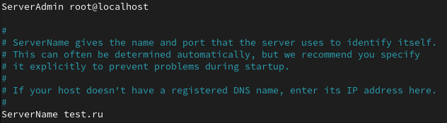

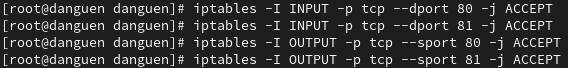

#

# 2. Выполнение работы

- Убедиться, что SELinux работает в режиме enforcing политики targeted с помощью команд getenforce и sestatus

- Проверять, что услуга httpd работает

- Использовать команду ps auxZ | grep httpd, найти веб-сервер Apache в списке процессов

- Посмотрить статистику по политике с помощью команды seinfo

#

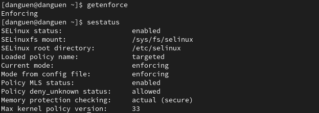

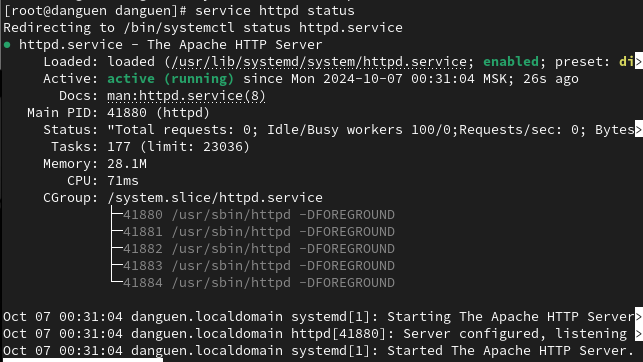

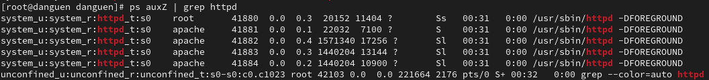

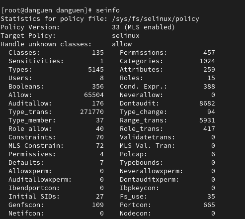

#

# 2. Выполнение работы

- Создать от имени суперпользователя html-файл /var/www/html/test.html

- Обратиться к файлу через веб-сервер, введя в браузере адрес http://127.0.0.1/test.html

- Проверить контекст файла test.html можно командой ls -Z /var/www/html/test.html

- Измените контекст файла /var/www/html/test.html с httpd_sys_content_t на samba_share_t

#

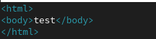

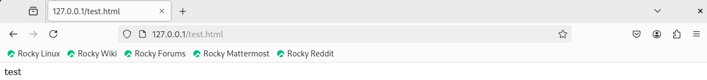

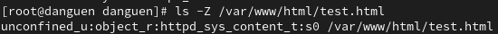

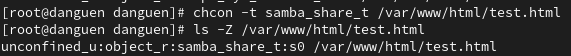

# 2. Выполнение работы

- Попробовать ещё раз получить доступ к файлу через веб-сервер

- Попробовать запустить веб-сервер Apache на прослушивание ТСР-порта 81 и убедиться, что порт 81 появился в списке

- Выполнять перезапуск веб-сервера Apache и проанализировать лог-файлы

- Вернуть контекст httpd_sys_cоntent__t к файлу /var/www/html/ test.html

#

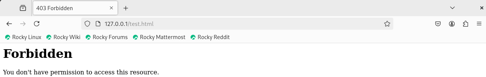

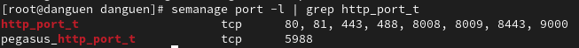

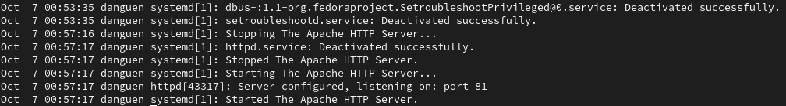

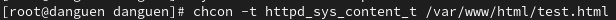

# 2. Выполнение работы

- Попробовать получить доступ к файлу через веб-сервер, введя в браузере адрес http://127.0.0.1:81/test.html

- Удалить файл /var/www/html/test.html.- Удалить файл /var/www/html/test.html.

#

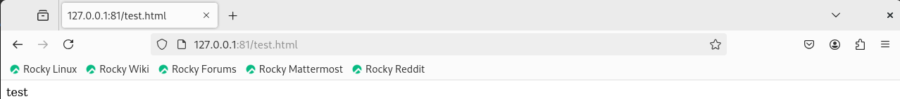

# Вывод

После работы я получил практическое знакомство с технологией SELinux и развил навыки работы с ним.