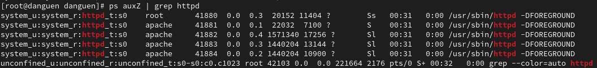

---
## Front matter
title: "Отчёт по лабораторной работе №6"
subtitle: "Мандатное разграничение прав в Linux"
author: "Нгуен Дык Ань"

## Generic otions
lang: ru-RU
toc-title: "Содержание"

## Bibliography
bibliography: bib/cite.bib
csl: pandoc/csl/gost-r-7-0-5-2008-numeric.csl

## Pdf output format
toc: true # Table of contents
toc-depth: 2
lof: false # List of figures
lot: false # List of tables
fontsize: 12pt
linestretch: 1.5
papersize: a4
documentclass: scrreprt
## I18n polyglossia
polyglossia-lang:
  name: russian
  options:
	- spelling=modern
	- babelshorthands=true
polyglossia-otherlangs:
  name: english
## I18n babel
babel-lang: russian
babel-otherlangs: english
## Fonts
mainfont: PT Serif
romanfont: PT Serif
sansfont: PT Sans
monofont: PT Mono
mainfontoptions: Ligatures=TeX
romanfontoptions: Ligatures=TeX
sansfontoptions: Ligatures=TeX,Scale=MatchLowercase
monofontoptions: Scale=MatchLowercase,Scale=0.9
## Biblatex
biblatex: true
biblio-style: "gost-numeric"
biblatexoptions:
  - parentracker=true
  - backend=biber
  - hyperref=auto
  - language=auto
  - autolang=other*
  - citestyle=gost-numeric
## Pandoc-crossref LaTeX customization
figureTitle: "Рис."
tableTitle: "Таблица"
listingTitle: "Листинг"
lofTitle: "Список иллюстраций"
lotTitle: "Список таблиц"
lolTitle: "Листинги"
## Misc options
indent: true
header-includes:
  - \usepackage[T2B]{fontenc}
  - \usepackage{indentfirst}
---

# I.Цель работы

Развить навыки администрирования OC Linux. Получить первое практическое знакомство с технологией SELinux.

# II. Выполнение работы

## 1. Подготовка лабораторного стенда

- Задать параметр ServerName в конфигурационном файле /etc/httpd/httpd.conf.

- Проследить, чтобы пакетный фильтр был отключён или в своей рабочей конфигурации позволял подключаться к 80-у и 81-у портам протокола tcp.

## 2. Выполнение работы

- Убедиться, что SELinux работает в режиме enforcing политики targeted с помощью команд getenforce и sestatus.

- Проверять, что услуга httpd работает. Если она не работает, то запустить её с параметром start.

- Использовать команду ps auxZ | grep httpd, найти веб-сервер Apache в списке процессов. В нем находится контекст безопасности "system_u:system_r:httpd_t:s0", где:

1. system_u — это системный пользователь, который обычно используется для системных служб, управляемых SELinux.

2. system_r — это системная роль, которая позволяет процессам выполнять различные задачи на системном уровне.

3. httpd_t — это тип, используемый Apache HTTP Server (httpd).

4. s0 — это уровень безопасности по умолчанию в SELinux, обычно связанный с несекретными данными.

- Посмотрить текущее состояние переключателей SELinux для Apache с помощью команды.

- Посмотрить статистику по политике с помощью команды seinfo, результат даёт количество пользователей, типов, ролей и т.д.

- Создать от имени суперпользователя html-файл /var/www/html/test.html следующего содержания.

- Обратиться к файлу через веб-сервер, введя в браузере адрес http://127.0.0.1/test.html.

- Проверить контекст файла test.html можно командой ls -Z /var/www/html/test.html.

1. Поскольку по умолчанию пользователи не ограничены, созданный нами файл test.html был сопоставлен с SELinux, пользователем unconfined_u

2. Роль object_r используется по умолчанию для файлов на «постоянных» носителях и в сетевых файловых системах

3. Тип httpd_sys_content_t позволяет процессу httpd получать доступ к файлустипа, с ним мы получили доступ к файлу при доступе к нему через браузер

- Изменить контекст файла /var/www/html/test.html с httpd_sys_content_t на samba_share_t, которого процесс httpd не иметь доступа.

- Попробовать ещё раз получить доступ к файлу через веб-сервер, введя в браузере адрес http://127.0.0.1/test.html.

- Попробовать запустить веб-сервер Apache на прослушивание ТСР-порта 81 и убедиться, что порт 81 появился в списке.

- Выполнять перезапуск веб-сервера Apache и проанализировать лог-файлы.

- Вернуть контекст httpd_sys_cоntent__t к файлу /var/www/html/ test.html.

- Попробовать получить доступ к файлу через веб-сервер, введя в браузере адрес http://127.0.0.1:81/test.html.

- Удалить файл /var/www/html/test.html.

# III. Вывод

После работы я получил практическое знакомство с технологией SELinux и развил навыки работы с ним.