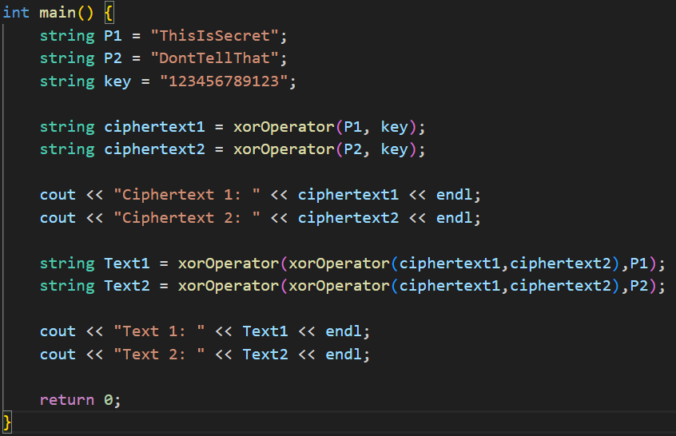

---
## Front matter
lang: ru-RU
title: Презентация по лабораторной работе №8
subtitle: Элементы криптографии. Шифрование (кодирование) различных исходных текстов одним ключом
author:
  - Нгуен Дык Ань
institute:
  - Российский университет дружбы народов, Москва, Россия
date: 26 Октябрь 2024

## i18n babel
babel-lang: russian
babel-otherlangs: english

## Formatting pdf
toc: false
toc-title: Содержание
slide_level: 2
aspectratio: 43
section-titles: true
theme: metropolis
header-includes:
 - \metroset{progressbar=frametitle,sectionpage=progressbar,numbering=fraction}
 - '\makeatletter'
 - '\beamer@ignorenonframefalse'
 - '\makeatother'
---

# Докладчик

:::::::::::::: {.columns align=center}
::: {.column width="70%"}

  * Нгуен Дык Ань
  * Студенческий билет: 1032215251
  * Группа: НКНбд-01-21
  * Российский университет дружбы народов
  * <https://github.com/NguyenDucAnh0512>

:::
::: {.column width="30%"}

:::
::::::::::::::

# Цель работы

Освоить на практике применение режима одноключевого кодирования на примере кодирования различных исходных текстов одним ключом

# Выполнения работы

- Мы используем метод шифрования: Выполнение операции сложения по модулю 2 (XOR) как на лаборатоной работе 7 

# Выполнения работы

#

- В main мы определем 2 исходного текста с называниями P1 и P2 и ключ key.

- Используовать функцию "xorOperator" для генерации зашифрованного текста и вывода зашифрованного текста на экран.

#

- В ситуации, когда злоумышленник знал один из двух текста, он может прочитать остальный, не зная ключа и не стремясь его определить, на основе свойства операции XOR: 1 + 1 = 0, 1 + 0 = 1

- Получаем С1 + С2 = P1 + K + P2 + K = P1 + P2, следует C1 + C2 + P1 = P1 + P2 + P1 = P2

# Результат программы

# Вывод

После лаборатоной работы я получил практические навыки по применению режима одноключевого кодирования на примере кодирования различных исходных текстов одним ключом
